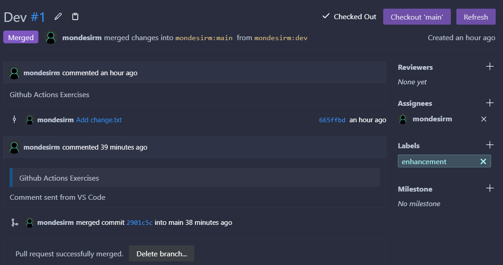

# Github Action Exercices

## Events

### Push
1. *Create and publish 3 branches, "dev", "staging", "feat/feature-1"*
```sh
git switch -c dev && git push --set-upstream origin dev
git switch -c staging && git push --set-upstream origin staging
git switch -c feat/feature-1 && git push --set-upstream origin feat/feature-1
```

2. When you have a push on the branch "dev" only
```yml
on:
  push:
    branches:
      - dev
```

3. When you have a push on any branch except "staging"
```yml
on:
  push:
    branches-ignore:
      - staging
```

4. When you have a push on any branch where the name starts with "feat"
```yml
on:
  push:
    branches:
      - feat/*
```

5. When only the files with a ts extension have been modified
```yml
on:
  push:
    paths:
      - '**.ts'
```

6. When a specific folder have been modified
```yml
on:
  push:
    paths:
      - 'src/**
```

### Pull request
1. When someone creates a PR
```yml
on:
  pull_request:
    types: [opened]
```

2. When someone closed a PR
```yml
on:
  pull_request:
    types: [closed]
```

### Scheduled
1. Every 5 minutes
```yml
on:
  schedule:
    - cron: "*/5 * * * *"
```

2. Every 1h 30m
```yml
on:
  schedule:
    - cron: '30 0-21/3 * * *'
    - cron: '30 1-22/3 * * *'
```

3. Every Tuesday at 3am
```yml
on:
  schedule:
    - cron: '0 3 * * 2'
```

### Push & PR
1. Create two jobs inside a new workflow
```yml
jobs:
  one:
    runs-on: ubuntu-latest

    steps:
      - run: echo one

  two:
    runs-on: ubuntu-latest

    steps:
      - run: echo two
```

2. When you have a push, execute both jobs
```yml
on: [push]
```

3. When you have a PR, only execute the first job.
```yml
on: [pull_request]

jobs:
  one:
    runs-on: ubuntu-latest

    steps:
      - run: echo one

  two:
    if: github.event_name != 'pull_request'
    runs-on: ubuntu-latest

    steps:
      - run: echo two
```

4. *Create a dev branch, and inside it create a dummy change.txt file. Put your name in it. Publish this branch*
```sh
git switch -c dev && echo "MONDESIR" > change.txt
git add . && git commit -m "Add change.txt"
git push --set-upstream origin dev
```

5. Create a pull request from the dev branch to main. You should see the first job executing directly inside the PR (from the github UI)



### Manual & Custom
1. When you click on run workflow button in the UI
```yml
on: [workflow_dispatch]
```

2. TODO Create two workflows
```yml
name: Target

on:
  repository_dispatch:
    types: [customEvent]

jobs:
  build:
    runs-on: ubuntu-latest

    steps:
      - run: Print client payload
        run: |
          echo ${{ github.event.client_payload.message }}
```
```yml
name: Client

on:
  repository_dispatch:
    types: [customEvent]

jobs:
  two:
    runs-on: ubuntu-latest
```

3. TODO Trigger the second workflow from the first one, and pass the github event name from the first one to the second with a variable named "firstJobEvent"
```yml

```

## Runners

### Job's default
1. Write a workflow that installs dependencies and runs the test. Specify a default folder for all the steps inside the job.
```yml
name: GA Exercices

on: [workflow_dispatch]

defaults:
  run:
    working-directory: ./

jobs:
  build-test:
    runs-on: ubuntu-latest

    steps:
      - name: Checkout
        uses: actions/checkout@v3

      - name: Setup Node.js
        uses: actions/setup-node@v3
        with:
          node-version: 16

      - name: Install dependencies
        run: |
          npm ci
          npm run build

      - name: Test the application
        run: |
          npm test
```

### Matrix 
1. Create a matrix strategy for a node js app that will install dependancies for node 12, 14, 16
```yml
strategy:
  matrix:
    node-version: [12.x, 14.x, 16.x]
```

```yml
- name: Setup Node.js
  uses: actions/setup-node@v3
  with:
    node-version: ${{ matrix.node-version }}
```

2. Create a second matrix strategy to test the node app on ubuntu and windows
```yml
strategy:
  matrix:
    os: [ubuntu-latest, windows-latest]
```

```yml
  build-test:
    runs-on: ${{ matrix.os }}
```

### Docker image runner
1. Now, instead of installing node js with the action, use a node image for the tests of the node-app
```yml
strategy:
  matrix:
    os: [node:12, node:14, node:16]
```

```yml
  build-test:
    runs-on: ${{ matrix.os }}
```

### Self-hosted runners
1. *Download the [self-hosted runner script](https://docs.github.com/en/actions/hosting-your-own-runners/adding-self-hosted-runners)*
2. Create a workflow that will install the node dependancies, test and run the app (`npm start`)
```yml
name: Self-hosted runner

on: [workflow_dispatch]

jobs:
  build-test:
    runs-on: self-hosted

    steps:
      - name: Checkout
        uses: actions/checkout@v3

      - name: Setup Node.js
        uses: actions/setup-node@v3
        with:
          node-version: 16

      - name: Install dependencies
        run: |
          npm ci
          npm run build

      - name: Test the application
        run: |
          npm test

      - name: Start the application
        run: |
          npm start
```

3. Look at the result from the job. Why is this a bad idea for public repositories ?

It's a bad idea because the self-hosted runner is not secured. Anyone can run a job on it.

## Environments
1. In your repo's settings, create two environnements. One for production, one for staging.
2. Write a workflow that deploy the joke app to heroku on a push to the main branch
3. Write a workflow that deploy the joke app to heroku on a push to the dev branch (on a different heroku app)
4. For each workflow, specify the corresponding environnement and the url of the app you created
```yml
name: Deploy to Heroku

on:
  push:
    branches:
      - main
      - dev

jobs:
  production:
    if: github.ref == 'refs/heads/main'
    runs-on: ubuntu-latest
    environment: production

    steps:
      - uses: actions/checkout@v3

      - uses: akhileshns/heroku-deploy@v3.12.12
        with:
          heroku_api_key: ${{secrets.HEROKU_API_KEY}}
          heroku_app_name: "mondesirm-heroku"
          heroku_email: "malikmondesir@gmail.com"
        env:
          HD_JOKE_URL: ${{secrets.JOKE_URL}}

  staging:
    if: github.ref == 'refs/heads/dev'
    runs-on: ubuntu-latest
    environment: staging

    steps:
      - uses: actions/checkout@v3

      - uses: akhileshns/heroku-deploy@v3.12.12
        with:
          heroku_api_key: ${{secrets.HEROKU_API_KEY}}
          heroku_app_name: "mondesirm-heroku-staging"
          heroku_email: "malikmondesir@gmail.com"
        env:
          HD_JOKE_URL: ${{secrets.JOKE_URL}}
```

5. For the production environnement, set the following secret : `JOKE_URL=https://v2.jokeapi.dev/joke/Programming`
6. For the staging environnement, set the following secret : `JOKE_URL=https://v2.jokeapi.dev/joke/Any?blacklistFlags=racist,sexist`
7. Use the secret to incorporate different joke url depending on the environnement ([Help](https://github.com/marketplace/actions/deploy-to-heroku#procfile-passing))

`app.service.ts`
```ts
async getJoke(): Promise<Joke> {
  const { JOKE_URL } = process.env;
  const response = await this.httpService.get(
    JOKE_URL,
    {
      headers: {
        accept: 'application/json',
      },
    },
  );
  const data = response.data;

  return data;
}
```